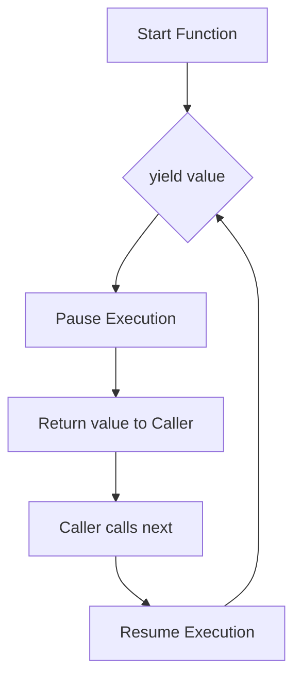

# Powerful Python Exercises & Resources

Welcome to the **Powerful Python** repository! This project is a curated collection of advanced Python exercises, code examples, and conceptual explanations designed to take your Python skills to the next level.

## Table of Contents
1. [Introduction](#introduction)
2. [Project Structure](#project-structure)
3. [Chapter 2: Scaling with Generators](#chapter-2-scaling-with-generators)
4. [Chapter 3: Creating Collections with Comprehensions](#chapter-3-creating-collections-with-comprehensions)
5. [Chapter 4: Advanced Functions](#chapter-4-advanced-functions)
6. [Chapter 5: Decorators](#chapter-5-decorators)
7. [Exercises & Practice](#exercises--practice)
8. [Getting Started](#getting-started)

---

## Introduction
This repository focuses on "Pythonic" ways of writing code—emphasizing readability, efficiency, and the use of powerful built-in features.

---

## Project Structure
Below is an overview of how the project is organized:
```text
.
├── ex_scaling_with_generators.py              # Chapter 2 Examples
├── ex_creating_collections_with_comprehensions.py # Chapter 3 Examples
├── ex_advanced_functions.py                    # Chapter 4 Examples
├── ex_decorators.py                            # Chapter 5 Examples
├── exercises/                                  # Practice exercises
│   ├── ex_generators.py
│   ├── ex_comprehensions.py
│   └── ex_decorators.py
├── solutions/                                  # Reference solutions
│   ├── sol_generators.py
│   ├── sol_comprehensions.py
│   └── sol_decorators.py
├── housedata.txt                               # Data for exercises
├── poem.txt                                    # Data for exercises
└── README.md                                   # This file
```

---

## Chapter 2: Scaling with Generators
Generators are a simple and powerful tool for creating iterators. They are written like regular functions but use the `yield` statement whenever they want to return data.

### Key Concepts
| Feature | Iterator | Generator |
| :--- | :--- | :--- |
| **Definition** | Class with `__iter__` and `__next__` | Function with `yield` |
| **Memory** | Can be high if pre-calculated | Very Low (Lazy evaluation) |
| **State** | Manually managed | Automatically saved |

### How Generators Work


**Example:**
```python
def count_up_to(max):
    count = 1
    while count <= max:
        yield count
        count += 1
```

---

## Chapter 3: Creating Collections with Comprehensions
Comprehensions provide a concise way to create lists, dictionaries, and sets.

### Types of Comprehensions
1. **List Comprehension:** `[expr for item in iterable if condition]`
2. **Dict Comprehension:** `{key_expr: val_expr for item in iterable}`
3. **Set Comprehension:** `{expr for item in iterable}`
4. **Generator Expression:** `(expr for item in iterable)`

**Pro Tip:** Use generator expressions when working with large datasets to save memory!

---

## Chapter 4: Advanced Functions
Exploring `*args`, `**kwargs`, and functional programming tools.

- **`*args`**: Pass a variable number of non-keyword arguments.
- **`**kwargs`**: Pass a variable number of keyword arguments.
- **Higher-Order Functions**: Functions that take other functions as arguments (e.g., `map`, `filter`, `sorted`).

---

## Chapter 5: Decorators
Decorators allow you to "wrap" another function in order to extend its behavior without permanently modifying it.

### The Wrapper Pattern
```python
def my_decorator(func):
    def wrapper(*args, **kwargs):
        # Do something before
        result = func(*args, **kwargs)
        # Do something after
        return result
    return wrapper
```

---

## Exercises & Practice
Check out the `exercises/` directory for hands-on practice:
- `exercises/ex_generators.py`: Practice building efficient data streams.
- `exercises/ex_comprehensions.py`: Refactor loops into elegant comprehensions.
- `exercises/ex_decorators.py`: Enhance function behavior dynamically.

*Solutions can be found in `solutions/`.*

---

## Getting Started
1. Clone the repo.
2. Ensure you have Python 3.8+ installed.
3. Run any of the example files (e.g., `python ex_scaling_with_generators.py`) to see examples in action.
